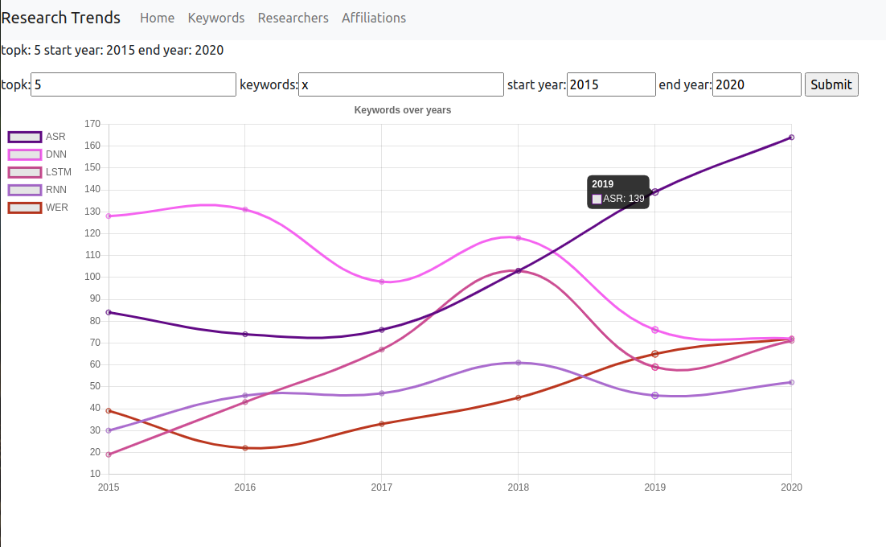
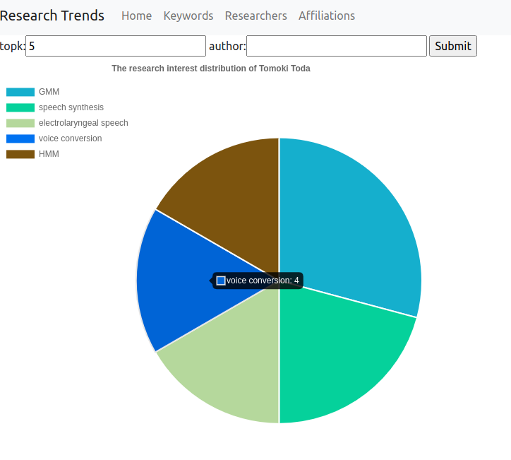
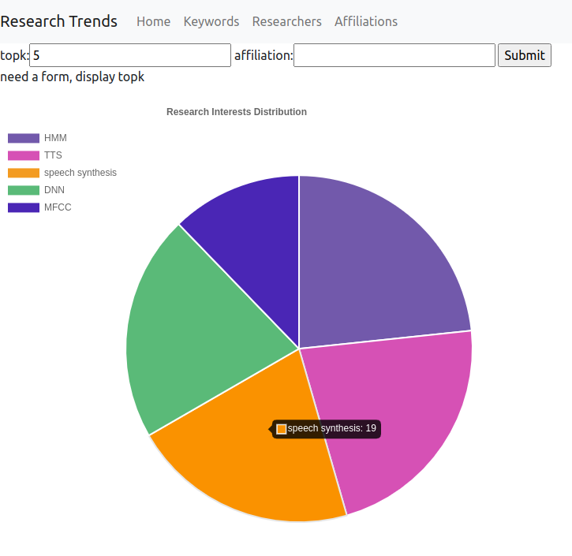

# Research Trends 

## Introduction

This project attempts to answer two questions for those who are new to a research field:
- If I want to follow the state-of-the-art topics, then which one is trending now? 
- If I am interested in a specific topic, which researcher or affiliation's work should I follow for more details?
  
However, these two questions are still too broad to answer, and extent to more sub-problems: What is a "topic"? How do we extract a topic for one paper? What kind of paper should we look at? Which conference? 

As a result, in practice, we narrowed the original questions down to the following tasks, resolved them one by one, and presented the results through a website.
- Only look at INTERSPEECH conference papers from 2010 to 2021.
- Use all-cap words and the most frequent word within a cluster as **topics**, also known as **keywords** in the repository.
- As for which topic or keyword is trending: given the start year and the end year, show the change curve over years of **top k most popular keywords**. If there are more papers related to a keyword in the database, then the keyword becomes more popular.
- As for who to follow: given a researcher or affiliation's name, show the research interest distributions with pie chart, offering some hints for users to make their decision.

## Project Structure 
There are three main modules and one extension part in this project. We will give a brief introduction to the main functions of each module. For more details, including the tools it uses, implementation, workflow, usage and example output address, please refer to `README.md` under the corresponding directory.
### Collect 
- corresponding directory : `collect`
- [documentation](collect/README.md)
- This module crawls down paper metadata from [interspeech archive](https://www.isca-speech.org/archive/), further extract needed information from pdf files, tidy, integrate and format them into a single XML file, which can be verified by a pre-defined XSD schema.

### Process 
- corresponding directory : `process`
- [documentation](process/README.md)
- This module shows 4 methods to extract keywords from paper metadata: All-cap words, TfIdf, Topic Modeling, and Clustering. The results will be stored in 5 JSON files, each file represent a table. The JSON files can further be imported to any relational database using [Django](https://www.djangoproject.com/) in the next step.

### Access 
- corresponding directory : `access`
- [documentation](access/README.md)
- This module loads 5 JSON files into a relational database, set up a website to accept and process user's query and present the results. 
- Screenshots:
  
  
  

### Extension Module
- corresponding directory : `collect`
- [documentation](extension/README.md)
- This module compare the write and read efficiency of three types of database: [MySQL](https://www.mysql.com/), [MangoDB](https://www.mongodb.com/) and [ElasticSearch](https://www.elastic.co/), which give us a hint about which database backend we can plug in to the Django framework.