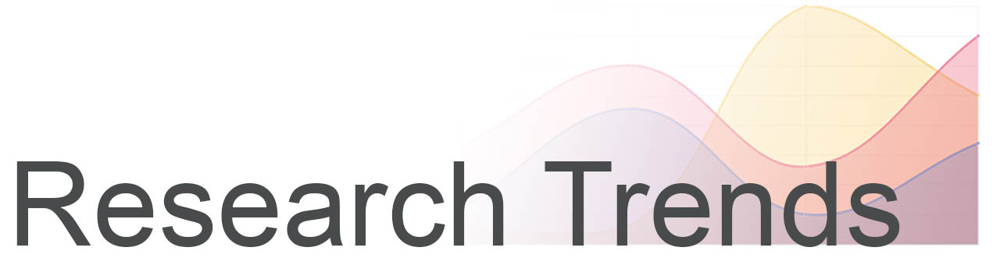
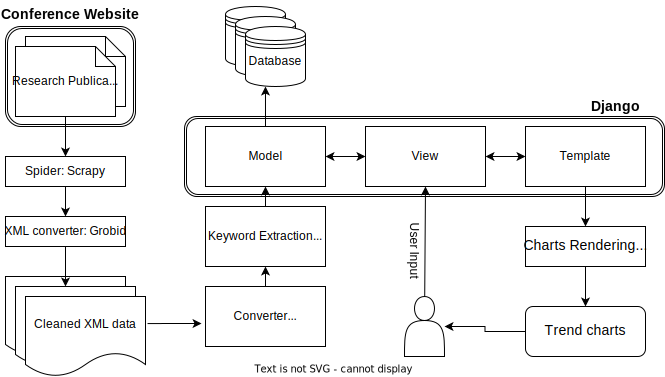

This is the project to help you with selecting and analysing your research interests through a visually appealing way. With this project, you will be able to carry out the following tasks:
- Look at the trends for a particularly interesting research and look its trend over a period of time in various conferences. 
- Look at the topics a particular professor has been researching on based on his research publications
- Target a particular institution and see the latest and most popular researches being carried out there.

## Quick links to Research Trends documentations:

- [Quick links to Research Trends documentations:](#quick-links-to-research-trends-documentations)
- [Data Collection](#data-collection)
- [Data Processing](#data-processing)
  - [Keyword Extraction](#keyword-extraction)
  - [XML to JSON](#xml-to-json)
- [Accessing the Application](#accessing-the-application)
- [Running the application](#running-the-application)
- [System Diagram](#system-diagram)

## Data Collection 

- [Documentation](collect/README.md)
- Directory: `./collect`

The aim of data collection was to build a corpus of all the publically available research publications from research conference websites. In order to achieve this goal, we used the following flow:


From each research publication, we collected the following data-points:
- Title of the paper
- Abstract of the paper 
- List of authors 
- url
- Affiliation 
- Keywords/Index terms 


## Data Processing 
- [Documentation](process/README.md)
- Directory: `./process`

This module compare the write and read efficiency of three types of database: [MySQL](https://www.mysql.com/), [MangoDB](https://www.mongodb.com/) and [ElasticSearch](https://www.elastic.co/), which give us a hint about which database backend we can plug in to the Django framework.

### Keyword Extraction 
Apart from extracting different information using the above mentioned techniques, we also tried to perform few techniques to enhance our collection of keywords to make the spectrum of keywords even wider. We applied the following techniques for Keyword extraction.
- Tf-IDf based Keyword
- Capitalized words extraction
- Topic Modelling
- Clustering

Since the index terms dataset is sparse and has long-tail phenomemnon, the need for trying other techniques still prevails for the dataset. 

Workflow:


### XML to JSON 

We use a relational database and **Django** for **accessing the appliaction**, therefore we needed to decouple the XML files into 5 tables: **conference**, **author**, **affiliations**, **keywords**, and **paper**. 
Since **Django** comes with its own modelling functionality for **Json** file into the databases, so we used **JSON** to represent these 5 tables. 


## Accessing the Application 

- [Documentation](research_trends/README.md)
- Directory: `./research_trends`
  
Finally to make our entire pipeline accessing by end-user, we used the python **Django** Framework as it is based on Model View Architure [(MVC)](https://en.wikipedia.org/wiki/Model%E2%80%93view%E2%80%93controller). For Rendering the visual features, the charts and plots, in our project we also used [Chart.js](https://www.chartjs.org/).


## Running the application
The application is based on Django framework and this means that running the application is exactly the same. But in order to install the dependencies of the project, we advice you to install some [virtual environment](https://docs.python.org/3/library/venv.html) and create the virtual environment as follows:
```bash
pip install -r requirements.txt
```
The reqruied file _requirements.txt_ could be found in the project folder itself.

Once all the packages have been installed, you can navigate to the `research_trends` directory, follow the **Usage** session in the [document](./research_trends/README.md) to run our application. 

## System Diagram



---