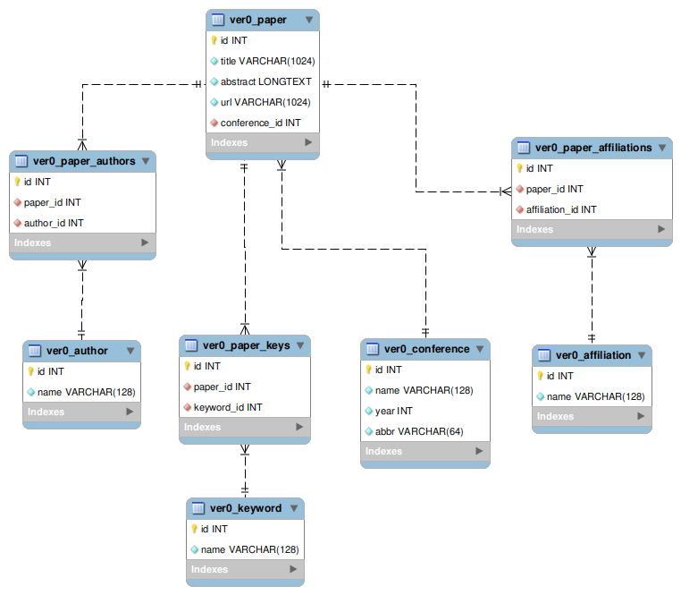

This project is designed to help you select and analyse your research interests in a visually appealing way. With this project, you will be able to carry out the following tasks:
- Examine trends for a particularly interesting area of research and follow its trend over a period of time and in various conferences. 
- View topics a particular researcher has been researching, based on his or her history of published research.
- Target a particular institution and see the latest and most popular research being conducted there.

**Quick links to Research Trends documentations**

- [Data Collection](#data-collection)
- [Data Processing](#data-processing)
  - [Keyword Extraction](#keyword-extraction)
  - [XML to JSON](#xml-to-json)
- [Accessing the Application](#accessing-the-application)
- [Running the Application](#running-the-application)
- [System Diagram](#system-diagram)
- [Extension](#extension)

## Data Collection 

- [Documentation](collect/README.md)
- Directory: `./collect`
- Example outputs
  - Step1 outputs: 
    - [raw xml](collect/examples/2010.xml), Scrapy's outputs in XML format. This file only contains papers published in 2010.
    - [papers.xml](collect/examples/step1_papers.xml), formatted Scrapy's outputs for better observation, lacking affiliation and index term information. This file only contains 100 papers.
  - Step2 output: 
    - [papers.xml](collect/examples/step2_papers.xml), 100 papers, sampled Scrapy's outputs + PDF information in XML format. 

The aim of data collection was to build a corpus of all the publically available research publications from research conference websites. In order to achieve this goal, we used the following flow:


From each research publication, we collected the following data-points:
- Title of the paper
- Abstract of the paper 
- List of authors 
- URL
- List of affliliated Institutions 
- Keywords/Index terms 


## Data Processing 
- [Documentation](process/README.md)
- Directory: `./process`
- Example outputs:
  - [papers.xml](process/examples/papers.xml): 100 example papers with augmented keywords. 
  - XML to JSON results: 100 example papers. We later use Django commands to load these JSON files to MySQL database.
    - [Affiliation](process/examples/json/aff.json)
    - [Author](process/examples/json/author.json)
    - [Conference](process/examples/json/conf.json)
    - [Keyword](process/examples/json/key.json)
    - [Paper](process/examples/json/paper.json)

This module compares the write and read efficiency of three database types: [MySQL](https://www.mysql.com/), [MangoDB](https://www.mongodb.com/) and [ElasticSearch](https://www.elastic.co/). This comparison gives us insights as to which database backend we should plug in to the Django framework.

### Keyword Extraction 
In addition to extracting information using the above mentioned techniques, we also employed several techniques to enhance our collection of keywords and to make the spectrum of keywords even wider. We applied the following techniques for Keyword extraction.
- Tf-IDf based Keyword
- Capitalized words extraction
- Topic Modelling
- Clustering

Since the index terms dataset is sparse and has the long-tail phenomenon, it was necessary to employ the above-mentioned techniques for the dataset. 

Workflow:


### XML to JSON 

We use a relational database and **Django** for **accessing the application**, therefore we needed to decouple the XML files into 5 tables: **conference**, **author**, **affiliations**, **keywords**, and **paper**. 
Because **Django** comes with its own modelling functionality for **JSON** files in the databases, we used **JSON** to represent these 5 tables. 

There are three many-to-many relations:
- *paper* and *author*
- *paper* and *keyword*
- *paper* and *affiliation*

The *conference_id* is a foreign key in *paper* table.

Database:


## Accessing the Application 

- [Documentation](research_trends/README.md): screenshots and usages
- Directory: `./research_trends`
- Example database
  - [mini.sql](research_trends/examples/mini.sql): This mini-database is extracted from a larger one. It has 100 papers and contains 5 main tables and the many-to-many relations. 
  
Finally, to make our entire pipeline accessible to the end-user, we used the python **Django** Framework as it is based on Model View Architecture [(MVC)](https://en.wikipedia.org/wiki/Model%E2%80%93view%E2%80%93controller). For Rendering the visual features, charts, and plots in our project, we also used [Chart.js](https://www.chartjs.org/).


## Running the Application
The application is based on Django framework and this means that running the application is exactly the same. However, in order to install the dependencies of the project, we advise you to install a [virtual environment](https://docs.python.org/3/library/venv.html) and create the virtual environment as follows:
```bash
pip install -r requirements.txt
```
The required file _requirements.txt_ can be found in the project folder itself.

Once all the packages have been installed, you can navigate to the `research_trends` directory, follow the **Usage** session in the [document](./research_trends/README.md) to run our application. 

## System Diagram


---

## Extension

Django is a flexible framework and supports many database backends. In order to decide which database should we use, we have compared different databases efficiency, including MySQL, MongoDB and ElasticSearch. 

A detailed report could be found [here](extension/README.md)