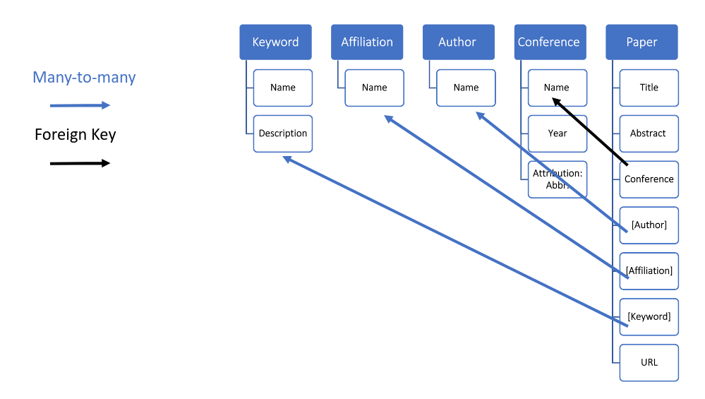

# Process 

## Introduction
Since the index terms dataset is sparse and has long-tail phenomemnon, we would like to find another way to extract keywords from a paper. 

This module includes two parts
- Analysis: shows 4 methods to extract keywords from paper metadata: All-cap words, TfIdf, Topic Modeling, and Clustering. 
- Prepare database for the next step. The results will be stored in 5 JSON files, each file represent a table. The JSON files can further be imported to any relational database using [Django](https://www.djangoproject.com/) in the next step.

## Step1: Keyword Extraction
- 4 methods: tfidf, topic modelling, keyword clustering, all-cap 
- requirements: [sklearn](https://scikit-learn.org/stable/), [pandas](https://pandas.pydata.org/), [numpy](https://pandas.pydata.org/), [spacy](spacy.io), [gensim](https://radimrehurek.com/gensim/) 
- path: `process/keyword_extraction`

### Text Normalisation
The text normalisation for all methods includes:
- lowercase(except for the **All-Cap** method), tokenisation, punctuation removement, lowercase using **gensim simple_preprocess** function 
- lemmatization using **spacy**, we keep only the open classes including noun, verb, adj, and adv.

### Methods
The naive and most straight-forward way is to use all-cap words(e.g. LSTM, DNN) as keywords.
- **All-Cap**: after text normalisation(without **lowercase**), extract those all-cap words and append them to the original keyword list.

To keep it simple, we only apply the following methods on the **abtract** part. Some methods might work better on the full text, but we haven't tried it yet.
- **TfIdf**: Computed via **sklearn**'s **TfidfVectorizer** with default parameter setting. 
- **Topic Modelling**: 
  - For the word vector representation, we use **sklearn.feature_etraction.text.CountVectorizer**. 
  - **sklearn**'s **LatentDirichletAllocation** module is used to compute the topics. `n_component` is set to 50, `max_iter` is set to 20. During the analysis phrase, we only look at the top 20 words for each topic.

In addition to extract keywords from abtract, we also try to cluster many index terms into one group, and represent those words with the most frequent word within the group.
- **Clustering**: 
  - For the word vector representation, we use the pretained [GloVe](https://nlp.stanford.edu/projects/glove/) model `glove-wiki-gigaword-50`. For those phrases, its vector representation is the element-wise summation of all the words in it. If one of word in that phrases is an out-of-vocabulary(OOV) word for the pretrained model, we skip these phrase. 
  - Cluster: we use **sklearn.cluster.KMeans** for clustering, `n_clusters` is set to 100, and `init` method is `k-means++`. 

### Usage
- The implementation and analysis of the above methods can be found respectively in [all cap.ipynb](keyword_extraction/all%20cap.ipynb), [tfidf.ipynb](keyword_extraction/tfidf.ipynb), [topic_modelling.ipynb](keyword_extraction/topic%20modelling.ipynb) and [clustering.ipynb](keyword_extraction/cluster.ipynb). 
- To replace the keywords with all-cap words, prepare the formatted XML produced in the [Collect step](../collect/README.md), and run:
  
  ```
  python all_cap.py formatted.xml output.xml
  ```

  The replaced version will be stored as `output.xml`. 

### TODO 
- [ ] Maybe we should also use word embedding for topic modelling. 
- [ ] Backoff to clustering method if there're no all-cap words in the abstract.

## Step 2: XML to JSON 

We use a relational database and **Django** for the **access** part, therefore we need to decouple the XML files into 5 tables: **conference**, **author**, **affiliations**, **keywords**, and **paper**. 
Since **Django** can automatically migrate a **Json** file into any backend relational database, so we use **JSON** to represent these 5 tables. 

### Database Design
Here's the database design:

Since a **paper** instance need to reference instances in other tables, we first load **conference**, **author**, **affiliations**, and **keywords** into four independant tables, and assign an unique ID for each instance. 

Then we finialize the **paper** table, replace the dependant  field's value with its ID in the corresponding table. 

Each row is a JSON object, and one table is stored in one single JSON file. So together there're five JSON files in total.

### Usage 

prepare the keyword-replaced XML file produced in [step 1](#step1-keyword-extraction) and run the following command, the results will be stored in the *tables* directory, they're `conference.json, author.json, aff.json, keywords.json, paper.json`
   ```
   mkdir tables
   python to_json.py input.xml
   ```

We can change to output directory by editing the `prefix` variable in [to_json.py](to_json.py)