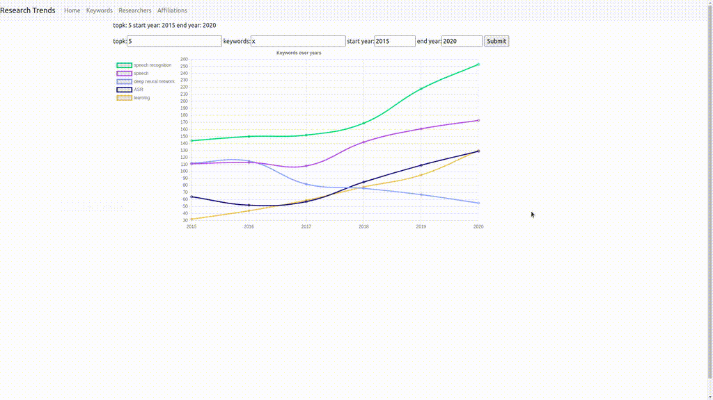
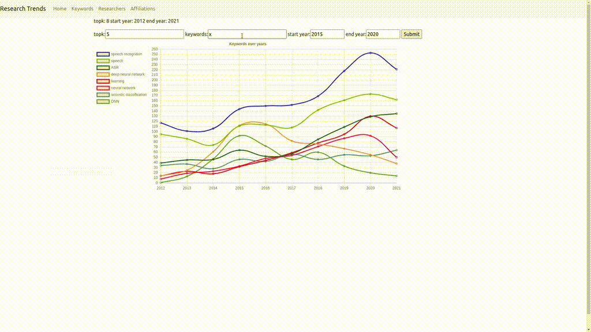
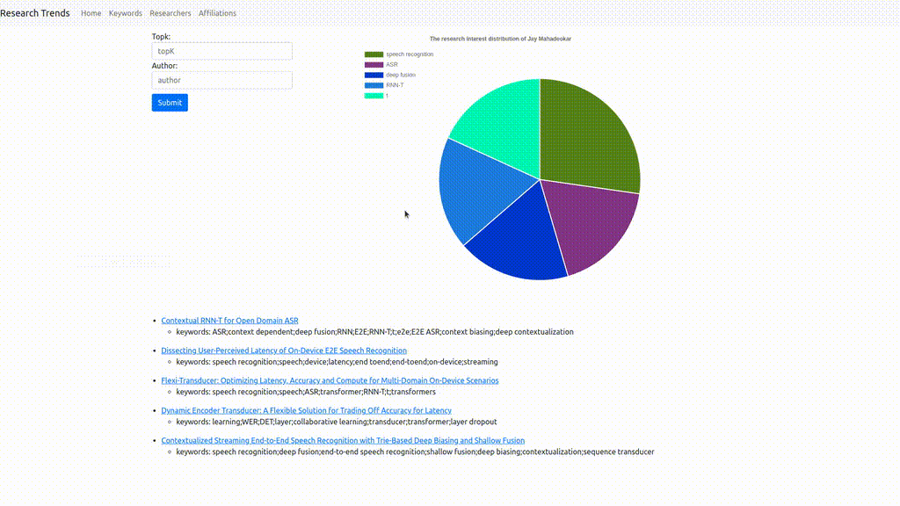
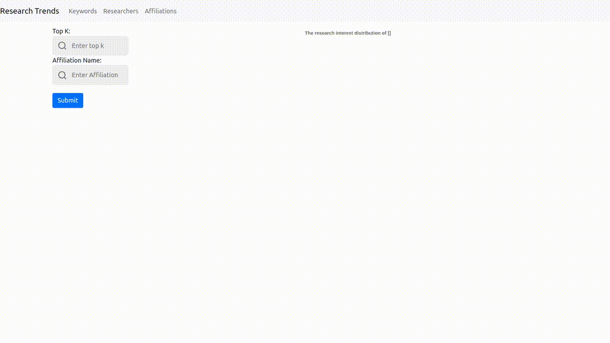

# Access

- Requirements:
  - [Django](https://www.djangoproject.com/)
  - [Chart.js](https://www.chartjs.org/)
  

## Introduction 
This module loads 5 JSON files(produced in [Process step](../process/README.md)) into a relational database, set up a website to accept and process user's query and present the results. 

We use [Django](https://www.djangoproject.com/) for better interaction and data accessing. [Chart.js](https://www.chartjs.org/) is used to plot the query results in the webpage. 


## Query 
Four types of query will be supported in this website

### Keywords Page 
1. How do the publication number of top k keywords change over years?
   - filters: start year, end year, top k 
   - return: line chart 
   - notice: `keyword` must be set to `x` in this case, otherwise it will fall into the second type of query.
   - example:
     - start year=2012, end year=2020, top k=8

2. How do the publication number of a given keyword change over years?
   - filters: start year, end year, keyword 
   - return: line chart
   - example: 
     - start year = 2013, end year=2021, keyword=LSTM;HMM



### Researchers and Affiliations Pages
1. What's the research interest distribution of a researcher within the given years? Only show the top k results
   - filters: topk, author
   - return: pie chart
   - example: topk=7, author="Ngoc Thang Vu"
   

1. What's the research interest distribution of an affiliation within the given years? Only show the top k results
   - filters: topk, affiliation 
   - return: pie chart
   - example: topk=6, affiliation="University of Suttgart"
   


## Usage: Test It Locally

Data loading: Clear the database and then load the each JSON files into database.
```
python manage.py flush 
python manage.py loaddata conference.json 
python manage.py loaddata author.json 
... 
```

Launch server:
```
python manage.py runserver 8080
```
`8080` is the port number. The website then will be host at `localhost:8080/ver0`
